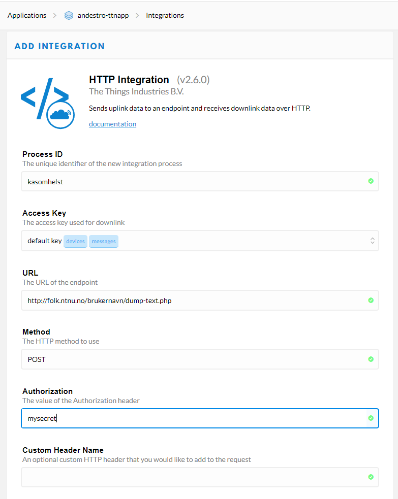
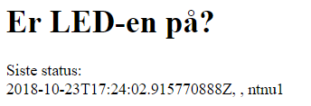

## Bakgrunn
Denne guiden er kun ment som et eksempel på hvordan man kan sette opp The Things Network til å sende data til sin egen side og hvordan man kan fange og lagre denne dataen. Dette er ikke ment som et prakteksempel på bruken av TTN eller HTTP integration, men det er et fungerende eksempel som viser at det er fullt mulig å fange og lagre data fra en LoRa-device ved hjelp av TTN og vise dette på en nettside. 

Denne guiden er inspirert av [elsysDemo](https://github.com/amundas/elsysDemo) av Amund Askeland.

# Sette opp HTTP Integration til folk.ntnu.no-hjemmeside
Følg standardprosedyren for TTN Quick Start.
På The Things Network-nettsiden, gå til din Application og trykk på fanen **"integrations".**
Velg deretter HTTP integration.

Du vil bli presentert med følgende meny.

* Gi prosessen et selvvalgt navn, det kan være hva som helst.
* Trykk på Access Key og velg default key.
* Under URL skriver du inn adressen til der du vil sende dataen din. **NB! Husk å skrive `http://` i linken her.** I dette tilfellet kan det være fint å starte med *dump-text.php*-scriptet. Sørg for at scriptet ligger på ditt hjemmeområde på NTNU ([se her for hvordan du kan legge filer der.](https://innsida.ntnu.no/wiki/-/wiki/Norsk/Koble+til+nettverksomr%C3%A5de+med+Windows)). Filer på hjemmeområdet ditt vil være tilgjengelig under http://folk.ntnu.no/brukernavn, etterfulgt av filnavnet på hjemmeområdet (eventuelt hvilken mappe det ligger i). Du kan sjekke at du linker riktig til scriptet ditt ved å gå til lenken i nettleseren hvor det bør stå "ok - dump file". 
* Method skal være satt til POST.
* Under Authorization kan vi i første omgang skrive "mysecret", men husk på at dette er veldig usikkert og er kun et eksempel. Hvis du bruker "mysecret" som autentisering vil alle som kjenner til "mysecret" kunne sende data som blir behandlet av scriptet ditt.
* Du kan legge til Custom Headers men det er ikke nødvendig i dette tilfellet.
* Trykk på *Add integration.* 

Nå er din HTTP integration kjørende!   

Neste gang The Things Network-applikasjonen din mottar en pakke fra en device vil dette sendes til scriptet ditt. Hvis alt fungerer slik det skal vil *dump-text.php* lagre JSON-dataen fra TTN i file *received_json.txt* på hjemmeområdet ditt. Sjekk gjerne at dette fungerer, ved å gå til f.eks. http://folk.ntnu.no/brukernavn/received_json.txt. Hvis du ikke får sendt pakker fra The Things Uno-en din kan du simulere en upload ved å velge devicen din på The Things Network-sida og sende en Payload via SIMULATE UPLINK-feltet. Ta gjerne en kikk på hvilken informasjon som blir lagret, det er mye mer data enn kun "nyttelasten" (payloaden) fra Devicen. Hva vil dere bruke? 

# Enkel lagring av data
Det er ikke nødvendigvis så nyttig å ha en oppdatert tekstfil med hele JSON-formatet som overskrives hver gang det sendes en pakke. I dette eksempelet kikker vi litt på hvordan du kan lagre utvalgte datafelt fra pakken, løpende. Ta gjerne en kikk på [denne guiden](https://www.taniarascia.com/how-to-use-json-data-with-php-or-javascript/) om du vil vite mer om hvordan man kan behandle JSON-formatet. Dette er heller ikke den beste løsninga, men det er et veldig enkelt eksempel så man kommer i gang. 

Nå ønsker vi å sende pakken vår til et annet script (denne gangen til *save-data.php*, som også må ligge på hjemmeområdet). For å endre destinasjon går vi simpelthen inn på HTTP-integrasjonen vi lagde og endrer URL-en til å peke til *save-data.php*. Dataen blir nå sendt til det nye scriptet neste gang en pakke sendes. 

Det nye scriptet bygger på det forrige, men det inneholder litt mer PHP-kode, noe som kan være ukjent for dere som ikke har sett det før. Derfor har vi kommentert dette scriptet slik at det skal være mulig å se hva de ulike delene gjør. Kort fortalt laster vi JSON-dataen inn i et PHP-array. Vi velger deretter ut noen utvalgte datafelt (time, led-status og gateways). Deretter lagrer vi dette til en fil *datalog.txt* der hver nye pakke blir en ny linje i fila. Sjekk gjerne at fila vokser etter hvert som vi mottar flere pakker fra The Things Network. 

**Pass på!** Denne fila vil bare vokse med mindre du gjør noe med den, vær derfor oppmerksom på at du kan ende opp med en veldig stor fil om du sender mye data ofte. 

Dette scriptet viser **prinsippet** at det er mulig å ta imot data fra en LoRa-device og vise det på en nettside. Når dataen havner på hjemmeområdet deres er det opp til dere hvordan dere vil behandle den og hvordan dere vil fremstille den. En forbedring av dette scriptet ville for eksempel være å sette opp en egen database og lagre dataen der, i stedet for direkte i en tekstfil. En annen idé kan være å behandle dataen mer, kanskje gjøre noen beregninger eller vise den frem på en fin måte før man lagrer den. 

# Enkel hjemmeside med oppdatert data
I fila *hjemmeside.php* har vi laget en helt enkel hjemmeside. Selv om fila er en PHP-fil er det mest HTML i den. Denne enkle HTML-en er nok kjent for de fleste. Den delen av fila som snakker PHP-språket er inni tagen som begynner med `<?php` og slutter med `?>`. 

Alt PHP-koden gjør er å åpne filen *datalog.txt* og laste den inn i en egen variabel kalt `$lines` (i PHP skal alle variabelnavn starte med `$`). `$lines` er en liste over linjene i fila. Deretter finner vi den siste linja i lista og spytter den ut til nettsiden ved hjelp av kommandoen `echo`. Det vi printer med `echo` havner i HTML-koden der vi har satt inn PHP-scriptet vårt. Resultatet vil se omtrent slik ut: 

Dette er et ganske enkelt eksempel som verken gjør mye eller ser bra ut, men det viser hvordan vi kan bruke et PHP-script i en nettside bygget opp av HTML til å hente ut info fra en fil. Hver gang vi går til sida http://folk.ntnu.no/brukernavn+filplassering/hjemmeside.php vil scriptet kjøres. Ettersom *datalog.txt* oppdateres hver gang LoRa-devicen sender en pakke vil hjemmesida vår hente ut siste mottatte pakke fra den nederste linja i *datalog.txt*.

Det er fullt mulig å bygge videre på dette. For eksempel kan man modifisere *save-data.php* til å lagre fint formatert data (f.eks. "PÅ"/"AV" i stedet for "1"/"", slik det er nå). Man kan også lage en litt mer avansert hjemmeside som bruker mer PHP til å gjøre noe med dataen vi henter ut og bruker denne dataen til å endre HTML-utseendet eller flere felter i HTML-en. I neste seksjon skal vi gi et litt større eksempel på en hjemmeside. 
